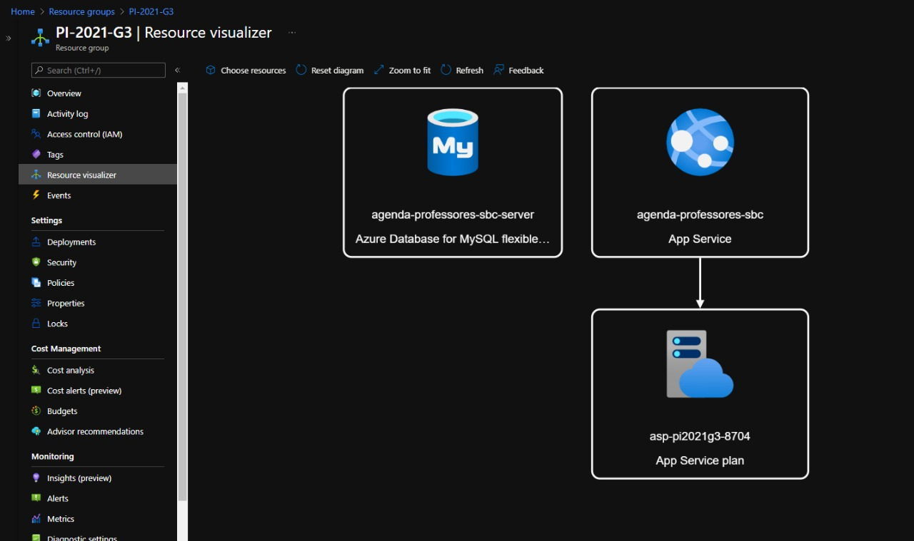
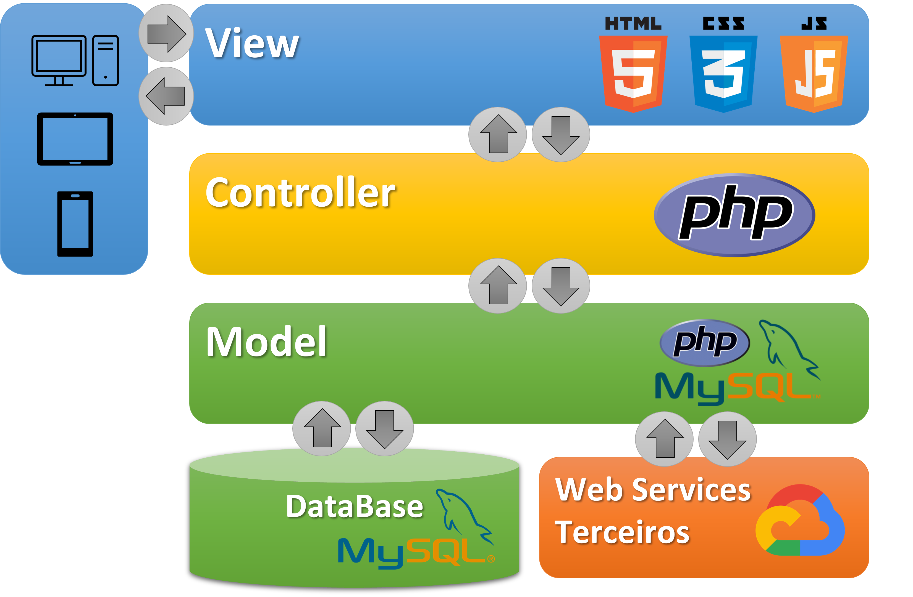

# PJI-110 Projeto Integrador Em Computação I 
## 2º Semestre-2021 - Grupo 3 - Polo São Bernardo do Campo 

### Orientador(a): Daniela Casimiro De Figueredo
### Alunos:
 - Andre de Oliveira Mendes Casanova <2000839@aluno.univesp.br> 
 - Bruna Martins Rogante <2014481@aluno.univesp.br>
 - Emerson de Mattos Reis <2009360@aluno.univesp.br>
 - Guilherme Padilha Batista <2011386@aluno.univesp.br>
 - Marcos Lohmann <2006775@aluno.univesp.br>
 - Rodrigo Henrique Machado da Silva <1402332@aluno.univesp.br> 
 - Victoria Sayuri Ishibaru da Silva <2007625@aluno.univesp.br>

## Tema
Software de identificação de disponibilidade de professores volantes para cobrir faltas de professores titulares da rede municipal de São Bernardo do Campo utilizando framework web, banco de dados e versionamento.

## Problema
Como auxiliar o Setor de Movimentação do Quadro de Magistério da Secretaria da Educação a identificar de forma ágil e precisa quais professores volantes teriam disponibilidade para atuarem como substitutos em outras escolas da rede municipal de São Bernardo do Campo?

## Objetivo
Desenvolver um software com framework web que utiliza banco de dados e controle de versões que seja capaz de sanar a dificuldade que funcionários do Setor de Movimentação do Quadro de Magistério da Secretaria de Educação do município de São Bernardo do Campo tem em realizar a movimentação de professores volantes entre escolas, levando em consideração a disponibilidade e a proximidade destes, afim de prover a substituição de professores titulares, em eventuais ausências, das escolas do município de São Bernardo do Campo.

## Implementação
### MS Azure
 - Site URL: https://agenda-professores-sbc.azurewebsites.net
 - Runtime Info: https://agenda-professores-sbc.azurewebsites.net/_info.php

### Diagrama dos Recursos

### Diagrama de Arquitetura

